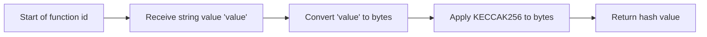

# Data Bus
This smart contract serves as an abstract data bus, which can be utilized to facilitate lightweight, inter-service communication.

## Features

- ability to send arbitrary events with arbitrary data
- minimalistic implementation
- low gas consumption
- does not require support and administration

## How it works

Here's the translation:

---

Each event in Ethereum consists of a list of topics and unindexed data. The first topic (topic 0) is usually the hash of the event signature (e.g., Deposit(address,uint256)), which helps identify the type of event. The other topics can be used to store the values of parameters that are marked as indexed in the event definition in the smart contract.

Thus, when we emit the event `SomeEvent(address)`, it triggers a call `SomeEvent(id("SomeEvent(address)"), address)`. This happens not explicitly, but internally within the EVM.

> How the `id` function works:



Our idea is that we create an abstract event that explicitly takes as the first argument the hash of the event signature, the second argument is `msg.sender`, and the third argument is abstractly specified as `bytes`.

```solidity
event Message(
    bytes32 indexed eventId,
    address indexed sender,
    bytes data
) anonymous;
```

As you might have noticed, we added an `anonymous` modifier to the event. This modifier records the event in the blockchain without the zeroth topic with the event signature (`event Message(bytes32 indexed, address indexed, bytes)`). Instead, the `eventId` we passed as the first argument will be recorded.

Next, we prepared the only method of the contract that emits the anonymous event.

```solidity
function sendMessage(bytes32 _eventId, bytes calldata _data)
```

To call it, you need to encode your own event signature, for example: `id(SomeEvent(address, bytes))`.
Then encode your second argument, depending on the type.
Afterward, you can call the `sendMessage` method and the result will be recorded in the blockchain.

Most libraries for working with Ethereum out of the box will work with parsing event data, additional logic will be required if the second data argument represents something other than `bytes`. In such a case, you will need to do additional `encode` at the time of loading the event.

For convenience and as an example, we prepared `DataBusClient`. This is an implementation of methods for reading and sending events, which operates based on human-readable ABI. This library is developed for TS, but it can be easily implemented in any language.

You can familiarize yourself with the library implementation: [library](/client/index.ts)

Also with usage examples:
- [Simple event monitoring](monitoring/index.ts)
- [Transaction spammer with arbitrary events](scripts/lib/spammer.ts)
- [Implementation of tests](test/DataBus.test.ts)

## Building and testing
Create .env file
```sh
CHIADO_BLOCKSCOUT=<your key from https://gnosis-chiado.blockscout.com>
NODE_HOST=http://127.0.0.1:8888
```

Install the dependencies
```sh
yarn
```
Compile the smart contracts code 
```sh
yarn compile
```
Run the tests
```sh
yarn test
```

## Test environment
A pre-installed environment can be used to test the smart contract. These environments include

- evm test node
- event monitoring system
- smart contract message spammer

To start the test environment, enter the command:

```sh
yarn stand:default
```

A test environment without message spammer is also provided, enter the command to run it:

```sh
yarn stand:monitoring
```

## Deploy

### Chiado — gnosis testnet
> Already deployed: https://gnosis-chiado.blockscout.com/address/0x42E1DEfC18388E3AA1fCADa851499A11405cf37f?tab=txs
1. Create account
```sh
yarn create-account --network chiado
```
2. Visit website https://faucet.chiadochain.net/ and earn some xDAI
3. Deploy

```sh
yarn deploy --network chiado
```
4. (Optional) Run Testing Stand

The testing stand consists of:
- transaction spammer
- console monitoring

with the help of the testing stand you can visualize the principles of Data Bus operation
